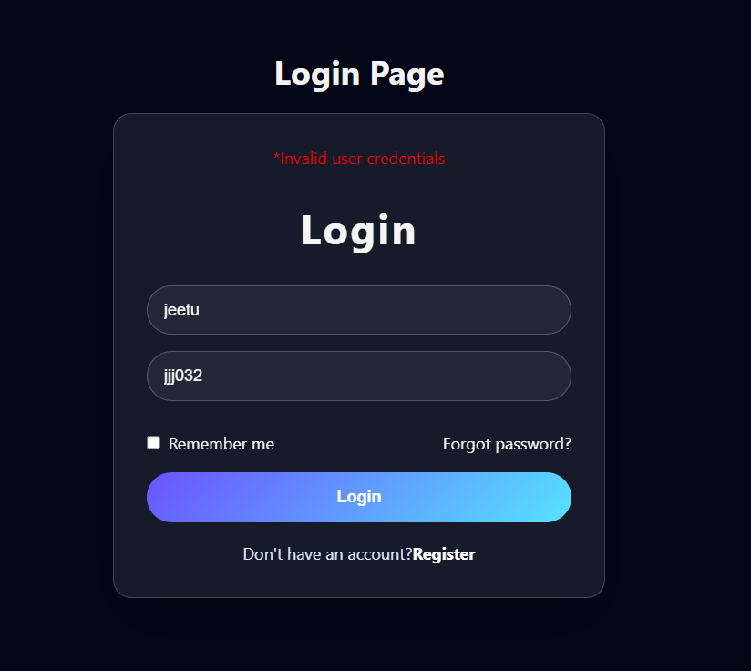
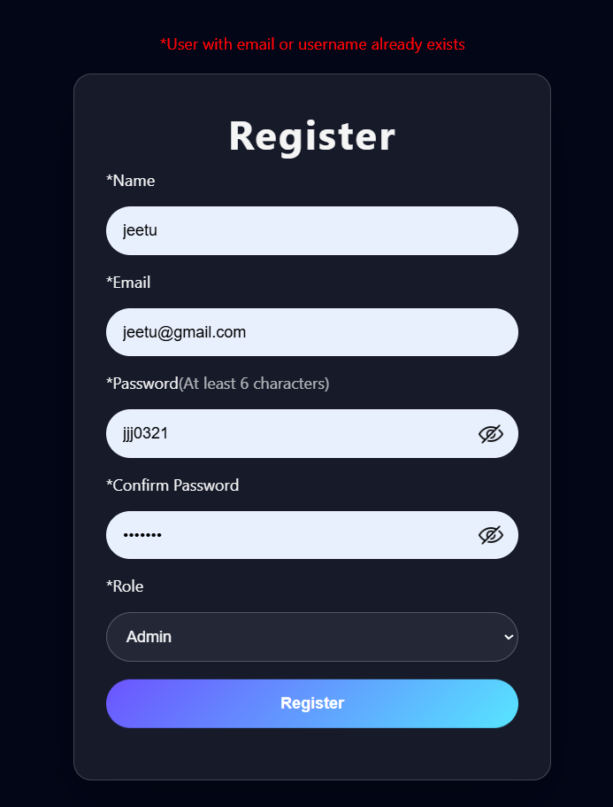
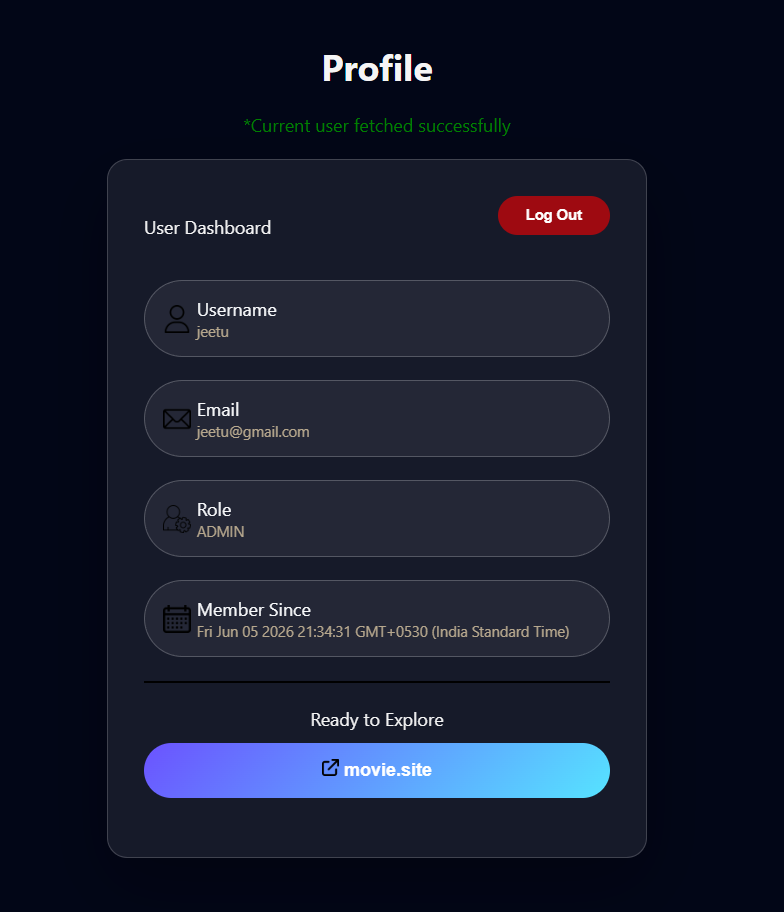

### Live Link
https://ashu73909.github.io/Authentication-App/

# Authentication Module (Vanilla JavaScript)

## Project Overview

This project implements a complete frontend authentication workflow using:

- HTML
- CSS
- Vanilla JavaScript
- FreeAPI Authentication Module

The goal of this project was to understand:

- User Registration
- User Login
- JWT Authentication
- Protected Pages
- Current User APIs
- Logout Flow
- Loading States
- Password Visibility Toggle
- Frontend ↔ Backend Communication

---

## Features

### Register User

Users can register by providing:

- Username
- Email
- Password
- Role

Frontend validations:

- Username must be lowercase
- Confirm password must match password

Flow:

Register Form → Frontend Validation → POST /register → Backend Stores User → Success Message → Redirect Login

---

### Login User

Users can login using:

- Username
- Password

Flow:

Login Form → POST /login → Backend Verifies Credentials → Backend Creates Access Token → Frontend Stores Token → Redirect Profile

---

### Current User

Profile data is fetched using the Current User API.

Flow:

Access Token → Authorization Header → GET /current-user → Backend Verifies Token → Returns User Data

Returned Data:

- Username
- Email
- Role
- Created Date

---

### Protected Profile Page

The profile page is protected from direct access.

Flow:

Profile Page Load → Check localStorage → Token Exists?

- Yes → Call Current User API
- No → Redirect Login Page

This prevents users from manually navigating to profile.html without authentication.

---

### Logout

Logout is handled using a backend API and frontend cleanup.

Flow:

Logout Button → POST /logout → Backend Invalidates Token → Remove Token From localStorage → Redirect Login

---

### Loading States

Loading UI is displayed during:

- Registration
- Login
- Logout

Flow:

Button Click → Show Loader → API Request → Hide Loader → Show Response

---

### Password Visibility Toggle

Implemented using Event Delegation.

Flow:

Eye Icon Click → Find Related Input → Toggle Password/Text

Concept Used:

- Event Delegation
- previousElementSibling
- Dynamic Input Type Switching

---

## APIs Used

### Register User

POST

https://api.freeapi.app/api/v1/users/register

Purpose:

Stores a new user in backend database.

Flow:

Frontend Data → Register API → Backend Validation → User Stored

---

### Login User

POST

https://api.freeapi.app/api/v1/users/login

Purpose:

Verifies credentials and generates an access token.

Flow:

Credentials → Login API → Backend Verification → Access Token Generated

---

### Current User

GET

https://api.freeapi.app/api/v1/users/current-user

Purpose:

Returns data of the currently authenticated user.

Flow:

Authorization Header → Token Verification → User Data Returned

---

### Logout User

POST

https://api.freeapi.app/api/v1/users/logout

Purpose:

Invalidates active authentication token/session.

Flow:

Logout Request → Backend Invalidates Token → User Logged Out

---

## HTTP Status Codes Learned

### 200

Request Successful

### 401

Unauthorized Request

Meaning:

User is not logged in or token is invalid.

### 404

Resource Not Found

Meaning:

Requested route does not exist.

### 409

Conflict

Meaning:

Duplicate username or email.

### 422

Validation Error

Meaning:

Frontend request reached backend successfully, but backend rejected the provided data.

---

## Authentication Concepts Learned

### Traditional Session + Cookie Authentication

Login → Backend Verification → Session Created → Session ID Stored → Cookie Sent To Browser → Browser Sends Cookie → Backend Finds Session → User Authenticated

---

### JWT Authentication

Login → Backend Verification → JWT Generated → Frontend Stores Token → Token Sent In Authorization Header → Backend Verifies Token → User Authenticated

---

## What Is JWT?

JWT stands for:

JSON Web Token

Purpose:

- Authentication
- Authorization

Instead of storing session data on the server, the token contains user information.

JWT Structure:

### Header

Contains:

- Token Type
- Algorithm

### Payload

Contains:

- User ID
- Username
- Email
- Role
- Issued Time
- Expiration Time

### Signature

Used to verify token integrity and authenticity.

---

## Access Token Flow

Backend Generates Token → Frontend Receives Token → localStorage Stores Token → Profile Request Reads Token → Authorization Header Added → Backend Verifies Token → User Data Returned

The Access Token acts as:

Proof Of Identity

---

## Local Storage

Purpose:

Store Access Token after successful login.

Flow:

Login Success → Receive Access Token → localStorage.setItem() → Token Available Across Pages

Used For:

- Protected Pages
- Current User API
- Authentication State

---

## JavaScript Concepts Used

### DOM Manipulation

- querySelector
- getElementById
- createElement
- append

### Events

- click events
- Event Delegation

### Async JavaScript

- async
- await

### Fetch API

- GET Requests
- POST Requests
- Headers
- Request Body
- JSON Responses

### Browser Storage

- localStorage
- setItem()
- getItem()
- removeItem()

---

## What I Learned

### Frontend

- Form Handling
- Validation
- Dynamic UI Updates
- Loading States
- Error Handling

### API Integration

- Sending Requests
- Reading Responses
- Status Codes
- Authentication Headers

### Authentication

- Registration Workflow
- Login Workflow
- JWT Authentication
- Protected Routes
- Current User APIs
- Logout Flow

### Debugging

- Browser DevTools
- Network Tab
- Console Logging
- API Response Inspection

---

## Why This Project Is Important

This project was the first step beyond simple DOM projects.

It introduced:

- Real Backend Communication
- Authentication Systems
- Authorization Concepts
- Protected Routes
- User State Management

These concepts are used in almost every modern application:

- Netflix
- Instagram
- LinkedIn
- GitHub
- YouTube
- Amazon

---

## Project Impact

This project demonstrates the ability to:

- Consume APIs
- Work with Authentication Systems
- Handle JWT Tokens
- Protect Application Routes
- Manage User Sessions
- Build Real User Workflows

It serves as a strong foundation for:

- React Authentication
- Full Stack Development
- Backend Development
- Production Web Applications

---

## Tech Stack

### Frontend

- HTML
- CSS
- Vanilla JavaScript

### APIs

- FreeAPI Authentication Module

### Authentication

- JWT (JSON Web Tokens)

### Browser Storage

- localStorage

---

## Final Outcome

A complete authentication system built with Vanilla JavaScript supporting:

- User Registration
- User Login
- JWT Authentication
- Protected Profile Pages
- Current User Fetching
- Secure Logout
- Loading States
- Error Handling
- Password Visibility Toggle

### Screen shots 
## Login

## Register

## Profile

